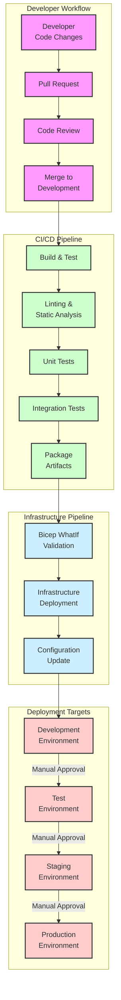

# VeritasVault.ai vv-iac

## Deployment FLow

```mermaid
flowchart TD
  subgraph "Developer Workflow"
    DevCode["Developer\nCode Changes"]
    PR["Pull Request"]
    CodeReview["Code Review"]
    MergeToDev["Merge to\nDevelopment"]
  end

  subgraph "CI/CD Pipeline"
    BuildTest["Build & Test"]
    Lint["Linting &\nStatic Analysis"]
    UnitTests["Unit Tests"]
    IntegrationTests["Integration Tests"]
    PackageArtifacts["Package\nArtifacts"]
  end

  subgraph "Infrastructure Pipeline"
    WhatIf["Bicep WhatIf\nValidation"]
    InfraDeploy["Infrastructure\nDeployment"]
    ConfigUpdate["Configuration\nUpdate"]
  end

  subgraph "Deployment Targets"
    DevEnv["Development\nEnvironment"]
    TestEnv["Test\nEnvironment"]
    StagingEnv["Staging\nEnvironment"]
    ProdEnv["Production\nEnvironment"]
  end

  DevCode --> PR
  PR --> CodeReview
  CodeReview --> MergeToDev
  
  MergeToDev --> BuildTest
  BuildTest --> Lint
  Lint --> UnitTests
  UnitTests --> IntegrationTests
  IntegrationTests --> PackageArtifacts
  
  PackageArtifacts --> WhatIf
  WhatIf --> InfraDeploy
  InfraDeploy --> ConfigUpdate
  
  ConfigUpdate --> DevEnv
  DevEnv -- "Manual Approval" --> TestEnv
  TestEnv -- "Manual Approval" --> StagingEnv
  StagingEnv -- "Manual Approval" --> ProdEnv
  
  classDef workflow fill:#f9f,stroke:#333,stroke-width:2px
  classDef cicd fill:#cfc,stroke:#333,stroke-width:2px
  classDef infra fill:#cef,stroke:#333,stroke-width:2px
  classDef deploy fill:#fcc,stroke:#333,stroke-width:2px
  
  class DevCode,PR,CodeReview,MergeToDev workflow
  class BuildTest,Lint,UnitTests,IntegrationTests,PackageArtifacts cicd
  class WhatIf,InfraDeploy,ConfigUpdate infra
  class DevEnv,TestEnv,StagingEnv,ProdEnv deploy
```
